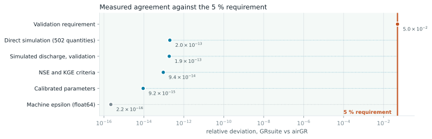
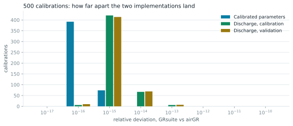

# GRsuite

**La suite des modèles pluie-débit GR d'airGR, en Python — validée au bit près contre airGR.**

[](https://github.com/Najim33/GRsuite/actions/workflows/ci.yml)
[](https://pypi.org/project/grsuite/)
[](https://pypi.org/project/grsuite/)
[](LICENSE)
[](docs/VALIDATION.md)

GR4J, GR5J, GR6J, GR2M, GR1A, GR4H, GR5H et le module neige CemaNeige — les
modèles que les hydrologues font tourner sous R depuis vingt ans, désormais en
Python sans dépendance à R, sans chaîne de compilation Fortran, et sans risque
de réimplémentation.

Chaque sortie de modèle, chaque critère et chaque jeu de paramètres calés de ce
package a été vérifié contre airGR 1.7.9 lui-même : **502 grandeurs — 1,23 million
de valeurs — concordent à 2 × 10⁻¹³ près, et sur 500 calages sur 100 bassins
français, l'écart maximal est de 1,9 × 10⁻¹³.**

```bash
pip install grsuite
```

---

## En soixante secondes

```python
import grsuite as gr

catchment = gr.Catchment(dates, precip=P, pot_evap=E, obs_discharge=Q)

fit = catchment.calibrate("GR4J", period=("2000-01-01", "2009-12-31"))
print(fit.describe())

check = fit.evaluate(period=("2010-01-01", "2019-12-31"))
print(check.nse(), check.kge())
```

```
GR4J calibrated on KGE = 0.8694
  X1       170.7158   production store capacity [mm]
  X2         0.5897   groundwater exchange coefficient [mm/step]
  X3        78.2571   routing store capacity [mm]
  X4         2.2568   unit hydrograph time constant [step]
  17 iterations, 202 model runs
0.799 0.776
```

Un test split-sample tient en un appel :

```python
fit, validation = catchment.split_sample(
    "GR6J",
    calibration=("2000-01-01", "2009-12-31"),
    validation=("2010-01-01", "2019-12-31"),
    criterion="KGE",
)
```

La neige, sur cinq bandes d'altitude, ne demande que la température et une
courbe hypsométrique :

```python
alpine = gr.Catchment(dates, precip=P, pot_evap=E, obs_discharge=Q,
                      temperature=T, hypsometry=elevation_quantiles)
fit = alpine.calibrate("CemaNeigeGR4J")
```

Tous les flux internes sont disponibles, sous les noms mêmes d'airGR :

```python
sim = fit.simulate()
sim.to_dataframe()[["Qobs", "Qsim", "Prod", "Rout", "Perc", "Exch"]]
sim.plot(log=True)
```

---

## Pourquoi ce projet existe

airGR est l'implémentation de référence des modèles GR : soignée, évaluée par
les pairs, maintenue à l'INRAE. Sa seule contrainte est de vivre dans R. Les
utilisateurs de Python devaient choisir entre appeler R via une passerelle, ou
faire confiance à une réimplémentation que personne n'avait vérifiée.

GRsuite supprime ce choix. Il a été écrit en traduisant ligne à ligne les noyaux
Fortran et la logique R d'airGR, et il est vérifié en continu contre les
sorties mêmes d'airGR, livrées avec la suite de tests. Si GRsuite et airGR
divergent un jour, la CI échoue.

| | |
|---|---|
| **Mêmes chiffres** | 502 grandeurs comparées valeur par valeur à airGR — [toutes les variables internes](docs/VALIDATION.md#the-internal-state-variable-by-variable), pas seulement le débit |
| **Même calage** | algorithme de Michel reproduit pas à pas — nombres d'itérations identiques sur 500 calages |
| **Pas besoin de R** | Python pur + NumPy, compilé JIT avec Numba |
| **Plus rapide** | 3,2× plus rapide qu'airGR sur les mêmes 500 calages |
| **Réellement utilisable** | une API de calage en une ligne par-dessus l'API fidèle qui reflète airGR |

---

## Ce qui est couvert

| Composant | Modèles et fonctions | Publié dans |
|---|---|---|
| Journalier | GR4J, GR5J, GR6J | Perrin et al. (2003) ; Le Moine (2008) ; Pushpalatha et al. (2011) |
| Horaire | GR4H, GR5H (avec ou sans le réservoir d'interception) | Mathevet (2005) ; Ficchì (2017) ; Ficchì et al. (2019) |
| Mensuel / annuel | GR2M, GR1A | Mouelhi et al. (2006a, 2006b) |
| Neige | CemaNeige, avec ou sans hystérésis linéaire | Valéry (2010) ; Valéry et al. (2014) ; Riboust et al. (2019) |
| Couplé | CemaNeige + GR4J / GR5J / GR6J / GR4H / GR5H | idem |
| Évapotranspiration | formule d'Oudin | Oudin et al. (2005) |
| Bandes d'altitude | extrapolation de Valéry, gradients de température journaliers | Valéry (2010) |
| Critères | NSE, KGE, KGE′, RMSE, composites pondérés | Nash & Sutcliffe (1970) ; Gupta et al. (2009) ; Kling et al. (2012) |
| Transformations | `sqrt`, `log`, `inv`, `sort`, `boxcox`, puissances | Santos et al. (2018) |
| Calage | algorithme de Michel (criblage de grille puis plus forte pente) | Michel (1991) |
| Utilitaires | agrégation de séries temporelles, routage semi-distribué, capacité d'interception | Lobligeois (2014) ; Ficchì et al. (2019) |

Les références bibliographiques complètes, avec leurs DOI, sont dans
**[docs/REFERENCES.md](docs/REFERENCES.md)**.

`CreateErrorCrit_GAPX` (de Lavenne et al., 2019) et les fonctions graphiques
d'airGR sont les seules pièces laissées de côté. GR6H n'existe pas dans
airGR 1.7.9, il n'existe donc pas ici non plus.

---

## Validation



Le cahier des charges imposait de rester sous les 5 %. L'accord mesuré est
onze ordres de grandeur meilleur, et se situe à la limite de précision des
fichiers de référence eux-mêmes.



Sur 500 calages indépendants — cinq configurations de modèles sur 100 bassins
CAMELS-FR — 34 jeux de paramètres sont ressortis *identiques au bit près* à
ceux d'airGR, et les autres ne diffèrent que sur le dernier chiffre
significatif d'un double.

**[Lire le rapport de validation complet →](docs/VALIDATION.md)**

Deux détails d'implémentation décident si une réimplémentation d'airGR est
simplement correcte ou réellement identique. Les deux sont documentés dans
**[docs/FIDELITY.md](docs/FIDELITY.md)** ; en résumé, le Fortran d'airGR
évalue `0.9` en simple précision avant de le promouvoir, et sa période de
chauffe automatique comporte une correction d'année bissextile. En rater un
seul et votre débit est faux de 2,4 × 10⁻⁷ ou 3 × 10⁻⁶ respectivement.

---

## Deux API, volontairement

**La haut niveau** — pour travailler efficacement.

```python
catchment = gr.Catchment(dates, precip=P, pot_evap=E, obs_discharge=Q)
fit = catchment.calibrate("GR6J", criterion="KGE", transfo="sqrt")
```

**La fidèle** — une traduction directe d'airGR, fonction par fonction, pour
porter un flux de travail R existant sans le repenser.

```python
inputs = gr.InputsModel(dates, precip=P, pot_evap=E)
options = gr.RunOptions(inputs, "GR4J", ind_period_run=index)
crit = gr.InputsCrit("NSE", obs=Q[index])
result = gr.calibration_michel(inputs, options, crit, gr.CalibOptions("GR4J"))
```

La correspondance de chaque fonction airGR vers son équivalent GRsuite est dans
**[docs/MIGRATING_FROM_AIRGR.md](docs/MIGRATING_FROM_AIRGR.md)**.

---

## Exemples

| Fichier | Ce qu'il montre |
|---|---|
| [`examples/01_simulate.py`](examples/01_simulate.py) | Faire tourner GR4J avec des paramètres connus, inspecter les flux internes |
| [`examples/02_calibrate.py`](examples/02_calibrate.py) | Caler, puis valider sur une période indépendante |
| [`examples/03_compare_models.py`](examples/03_compare_models.py) | GR4J vs GR5J vs GR6J sur le même bassin |
| [`examples/04_snow.py`](examples/04_snow.py) | CemaNeige sur bandes d'altitude, dynamique du manteau neigeux |
| [`examples/05_hourly.py`](examples/05_hourly.py) | GR4H et GR5H avec un réservoir d'interception |
| [`examples/06_low_flows.py`](examples/06_low_flows.py) | Fonctions objectif pour la performance en étiage |
| [`examples/07_semi_distributed.py`](examples/07_semi_distributed.py) | Routage de sous-bassins amont vers un exutoire |
| [`examples/08_from_csv.py`](examples/08_from_csv.py) | Partir d'un simple CSV et arriver à un modèle calé |

Tous tournent sur le bassin de démonstration livré dans `tests/data`, donc ils
fonctionnent directement après un clone.

---

## Installation

```bash
pip install grsuite            # exécution : numpy, numba
pip install "grsuite[io]"      # ajoute pandas pour les helpers DataFrame
```

Depuis les sources :

```bash
git clone https://github.com/Najim33/GRsuite
cd GRsuite
pip install -e ".[dev]"
pytest
```

Python 3.9 à 3.13, sous Linux, macOS et Windows.

---

## Performance

Les noyaux sont compilés JIT par Numba : le premier appel à un modèle paie un
coût de compilation d'une à deux secondes, et tout le reste tourne à vitesse
compilée. La recompilation est mise en cache sur disque entre les sessions.

Sur le benchmark des 500 calages (5 configurations × 100 bassins, 20 ans de
données journalières chacun) :

| | Temps horloge |
|---|---|
| airGR 1.7.9 (R + Fortran) | 17,5 min |
| GRsuite (Python + Numba) | 5,4 min |

Mêmes paramètres, mêmes critères, mêmes nombres d'itérations.

---

## Citer

GRsuite n'apporte aucune hydrologie nouvelle. Les modèles, l'algorithme de calage
et l'implémentation de référence appartiennent à leurs auteurs, au
Cemagref / Irstea / INRAE. Si GRsuite sert un travail publié, citez **airGR** :

> Coron, L., Thirel, G., Delaigue, O., Perrin, C., Andréassian, V. (2017).
> The suite of lumped GR hydrological models in an R package.
> *Environmental Modelling & Software*, 94, 166–171.
> doi:[10.1016/j.envsoft.2017.05.002](https://doi.org/10.1016/j.envsoft.2017.05.002)

> Coron, L., Delaigue, O., Thirel, G., Dorchies, D., Perrin, C., Michel, C.
> airGR: Suite of GR Hydrological Models for Precipitation-Runoff Modelling.
> Package R version 1.7.9, INRAE, unité de recherche HYCAR, Antony, France.
> doi:[10.15454/EX11NA](https://doi.org/10.15454/EX11NA)

**ainsi que le modèle réellement utilisé** — GR4J, c'est Perrin et al. (2003) ;
CemaNeige, c'est Valéry (2010) ; et ainsi de suite. Toutes ces références, avec
leurs DOI, sont rassemblées dans **[docs/REFERENCES.md](docs/REFERENCES.md)**.

Si le portage lui-même compte dans vos méthodes, citez aussi ce dépôt — voir
[CITATION.cff](CITATION.cff).

---

## Contribuer

Rapports de bogues, modèles, critères et exemples sont les bienvenus. Une seule
règle absolue : **tout ce qui change la numérique des modèles doit garder les
tests de comparaison airGR au vert.** Voir [CONTRIBUTING.md](CONTRIBUTING.md).

---

## Licence

GPL-2.0-or-later. GRsuite est une œuvre dérivée d'airGR (INRAE, GPL-2) et porte la
même licence — voir [NOTICE](NOTICE) pour l'attribution complète.

GRsuite est un projet indépendant et n'est pas approuvé par l'INRAE.

*This README is also available [in English](README.md).*
