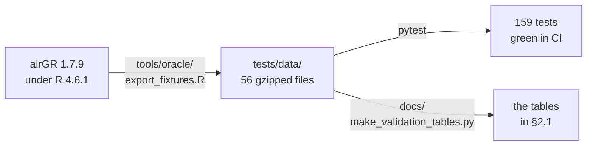
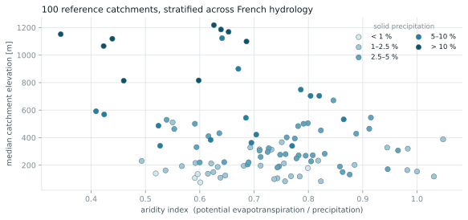
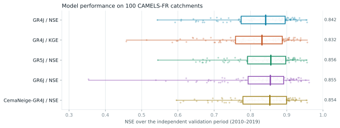

# Validation report

**GRsuite 1.0.0 against airGR 1.7.9**

> GRsuite is an unofficial, independent port of airGR, written and validated by
> one person. This report is that person's own work, not an INRAE evaluation of
> it: it says what was measured and how, so that a reader can check the claims
> instead of taking them on trust. The reference implementation remains
> [airGR](https://cran.r-project.org/package=airGR).

GRsuite is a re-implementation, so the only claim that matters is whether it
produces the same numbers as the package it re-implements. This report states what
was compared, how, and what came out.

The brief was to stay within **5 % deviation**. The largest deviation measured is
**2.0 × 10⁻¹³**, on direct simulation (§2.1), and **1.9 × 10⁻¹³** across the
calibration campaign (§3.1) — eleven orders of magnitude inside the requirement,
and at the precision limit of a double.

Two experiments, two scales, and they are easy to confuse: **502 quantities**
compared value by value on airGR's demonstration catchments, and **500
calibrations** run on 100 CAMELS-FR catchments. Section 2 says exactly what each
one covers.

### If you only read one thing

The report makes one factual claim — *GRsuite returns the numbers airGR returns* —
and everything else is detail. Three questions decide whether that claim holds,
and each has a section and a command:

| The question | Answer | Check it yourself |
|---|---|---|
| Did **airGR** produce the reference files, or did GRsuite produce them and compare against itself? | airGR, under R 4.6.1 | §1.1 — `Rscript tools/oracle/export_fixtures.R`, then compare hashes |
| How closely do the two agree? | worst case **2.0 × 10⁻¹³**, on 1.23 million values | §2.1 — `python docs/make_validation_tables.py` |
| Does that hold on real catchments, not just demonstration data? | yes on 500 calibrations, **but this part cannot be re-run from the repository** | §2.2, §3, and the caveat in §8 |

The honest summary in one line: **the numerical equivalence is fully verifiable
from this repository; the 100-catchment campaign is reported, not reproducible.**

---

## 1. Method

airGR 1.7.9 was installed and used as the oracle. Every quantity below is computed
twice — once by airGR in R, once by GRsuite in Python — from strictly identical
inputs, and compared element by element.

Comparison is done on both absolute and relative deviation, and a series passes
only if one of the two is within tolerance. The pair matters: several model outputs
legitimately cross zero, where a relative test is meaningless.

Reference outputs are written with 17 significant digits, so a double-precision
value survives the round trip through the exchange files exactly.

The reference files themselves are committed under [`tests/data`](../tests/data)
and drive the test suite, so **the comparison runs in CI on every commit, with no R
installation required**.

### 1.1 The chain of trust

A validation report is only worth the weakest link between "airGR computed this"
and "the badge is green". There are three links, and each one can be checked
independently:



| Link | The question a sceptic asks | How to settle it |
|---|---|---|
| ① | Did **airGR** produce `tests/data`, or did GRsuite produce it and then compare against itself? | Re-run the generator with R and compare — recipe below |
| ② | Do the tests really assert against those files? | `pytest`; every assertion goes through `assert_matches` in [`tests/conftest.py`](../tests/conftest.py) |
| ③ | Do the tables in §2.1 come from the same files? | `python docs/make_validation_tables.py` rewrites them |

**Link ① is the one that matters.** If `tests/data` had been generated by the
Python code, GRsuite would be comparing itself against itself: the 159 tests
would pass by construction and this entire report would be empty. That is why
the generator is committed.

To settle it: install airGR, run `tools/oracle/export_fixtures.R` in an empty
directory, and compare the *decompressed* content of the files it writes with the
committed ones — gzip stores a timestamp in its header, so the compressed bytes
differ while the content does not. Done on 2026-08-16 against the published
files: **56 / 56 identical**. Output that GRsuite had generated could not survive
that check against an independent airGR run.

---

## 2. What was compared

### 2.0 The two experiments, in plain terms

Before any numbers, here is what was actually done. Two experiments, and they ask
genuinely different questions.

#### Experiment A — the same calculation, run twice

Take one catchment. Take one parameter set, written down and not changed. Feed
exactly the same rainfall and evapotranspiration to airGR and to GRsuite, and let
each run the model over the same period.

airGR does not return a discharge series. It returns **the whole internal state of
the model at every time step**: how full the production store is, how much water
percolates out of it, what each branch of the unit hydrograph delivers, how much
is exchanged with the groundwater, what the snow pack weighs on each elevation
band. Eighteen to twenty-one such variables per model, depending on the model.

Every one of those numbers is placed side by side with GRsuite's.

> *Does GRsuite's numerical kernel compute the same thing as airGR's Fortran?*

Repeated across every model, every time step of the suite, the snow module, the
criteria and the parameter transformations, that comes to **502 quantities and
1 230 966 individual values**. §2.1 shows how that total is built up.

#### Experiment B — the same search, run separately

Experiment A fixes the parameters, so it says nothing about calibration. Take a
real catchment, hand both implementations the same forcing data, the same
calibration period, the same objective function and the same starting grid — then
let **each one run its own optimisation**.

This is the part worth being clear about: **GRsuite is not replaying a stored
airGR result.** Michel's algorithm searches a 4-to-8-dimensional parameter space,
hundreds of model runs deep, and the two implementations do it independently,
neither seeing the other's answer. What is compared is where they land.

> *Does the calibration algorithm converge to the same place, on catchments that
> are nothing like the demonstration data?*

Repeated over 5 model-and-objective configurations × 100 French catchments, that
is **500 calibrations**. §2.2 says which catchments and why.

#### Why both are needed

Experiment A is exhaustive but narrow: it exercises one trajectory through the
code, on three catchments that airGR ships. Experiment B is the opposite —
it never inspects an internal variable, but it sweeps the parameter space and runs
on catchments that are snowy, arid, flashy or slow. A bug that only fires in a
regime the demonstration catchments never visit would pass A and fail B.

---

Two separate experiments answer two separate questions, and their headline
numbers are not interchangeable:

| | Question | Scale | Where the data lives |
|---|---|---|---|
| **§2.1 Direct simulation** | does GRsuite compute the *same numbers* as airGR, variable by variable? | **502 quantities**, 1 230 966 individual values, on airGR's three demonstration catchments | `tests/data`, in this repository |
| **§2.2 Calibration campaign** | does Michel's algorithm *land in the same place*, catchment after catchment? | **500 calibrations** — 5 configurations × 100 CAMELS-FR catchments | `docs/data/campaign_*.csv` |

§2.1 is fully reproducible from a clone: the airGR reference files are committed,
and the inventory below is regenerated by a script. §2.2 needs CAMELS-FR and an R
installation, so only its result tables are shipped.

### 2.1 Direct simulation — 502 quantities, 1.23 million values

#### The set-up

| | |
|---|---|
| Catchments | airGR's own: **L0123001** (daily), **L0123002** (snow, 5 elevation bands), **L0123003** (hourly) |
| Periods | daily and snow: 1994-01-01 → 1999-12-31, **2 191 days**; hourly: 2005, **8 760 hours**; Oudin PE: the full 10 593-day record |
| Parameters | one fixed set per model, listed further down, identical on both sides |
| Runs | one per model — no calibration involved |

Not just discharge: every internal variable each model exposes. Production and
routing store levels, unit hydrograph outputs, percolation, net rainfall, actual
evapotranspiration, groundwater exchange in each branch, the exponential store,
the interception store, the snow pack and its thermal state band by band, and the
final state vector.

#### Where the 502 comes from

One "quantity" is one named output compared end to end — a full time series in
most cases, a scalar or a state vector in the rest. The total is the sum of
twelve blocks, each with its own small multiplication:

| Block | Arithmetic | Quantities |
|---|---|---|
| Daily models | GR4J (18 outputs + 1 state vector) + GR5J (18 + 1) + GR6J (20 + 1) | 59 |
| Hourly models | GR4H 18 + GR5H 21 + GR5H-with-interception 21 | 60 |
| Coupled snow | CemaNeige-GR4J, -GR5J, -GR4J-hysteresis (18 outputs + 1 scalar each) + -GR6J (20 + 1) | 78 |
| Snow module, band by band | 2 configurations × 5 elevation bands × 11 snow variables | 110 |
| Elevation bands, model input | 5 bands × 3 series (rainfall, temperature, solid fraction) | 15 |
| Parameter transformations | 9 models × 5 random draws × 2 directions | 90 |
| Error criteria | 4 criteria × 8 transformations + 1 composite | 33 |
| Monthly / annual | GR2M 11 outputs + GR1A 3 | 14 |
| Series aggregation | 4 aggregation modes × 3 variables | 12 |
| Calibration, demonstration catchment | 9 runs × (parameter vector, criterion value, iteration count) | 27 |
| Semi-distributed routing | `Qsim`, `Qsim_m3`, `QsimDown` | 3 |
| Oudin potential evapotranspiration | 1 series | 1 |
| **Total** | | **502** |

The value count follows the same way. GR4J, for instance: 18 series of 2 191 time
steps, plus a final state vector of 62 slots, gives 39 500 values — the figure in
the table below. Summed over the twelve blocks: **1 230 966**.

Each quantity is compared element by element. A value is counted as matching on
whichever of the two deviations is the smaller — absolute, or relative — because
several of these variables legitimately cross zero, where a relative test is
meaningless. The **worst deviation** column below is therefore the largest such
per-element minimum: the honest worst case under the criterion the test suite
actually applies.

| Category | Quantities | of which time series | Values compared | Worst deviation |
|---|---|---|---|---|
| Daily models — GR4J, GR5J, GR6J | 59 | 56 | 122 863 | 5.6 × 10⁻¹⁴ |
| Monthly / annual — GR2M, GR1A | 14 | 14 | 810 | 2.8 × 10⁻¹⁴ |
| Hourly — GR4H, GR5H, GR5H + interception | 60 | 60 | 525 600 | 2.0 × 10⁻¹³ |
| Elevation bands — P, T, solid fraction × 5 | 15 | 15 | 158 895 | 7.7 × 10⁻¹⁶ |
| Coupled snow — CemaNeige + GR4J / GR5J / GR6J, and hysteresis | 78 | 74 | 162 138 | 8.9 × 10⁻¹⁴ |
| Snow module, band by band | 110 | 110 | 241 010 | 2.5 × 10⁻¹⁴ |
| Oudin potential evapotranspiration | 1 | 1 | 10 593 | 8.9 × 10⁻¹⁶ |
| Error criteria — 33 criterion × transformation pairs | 33 | 0 | 33 | 2.8 × 10⁻¹⁴ |
| Parameter transformations — 45 sets, both directions | 90 | 0 | 330 | 2.7 × 10⁻¹⁶ |
| `SeriesAggreg` — monthly, annual, hydrological year | 12 | 12 | 2 178 | 8.5 × 10⁻¹⁶ |
| `RunModel_Lag` — two upstream sub-catchments | 3 | 3 | 6 453 | 3.5 × 10⁻¹⁴ |
| Calibration on the demonstration catchment — 9 runs | 27 | 0 | 63 | 4.6 × 10⁻¹⁵ |
| **Total** | **502** | **345** | **1 230 966** | **2.0 × 10⁻¹³** |

345 of the 502 are full time series; the remaining 157 are scalars (criterion
values, calibrated parameter sets, mean annual solid precipitation) and three
final state vectors. **96 quantities are bit-identical to airGR**, deviation
exactly zero.

#### The internal state, variable by variable

The claim above is "every internal variable", so here is every internal variable,
with the worst deviation each one reaches anywhere it appears — across models,
time steps and elevation bands.

| Variable | What it is | Series | Worst deviation |
|---|---|---|---|
| `PR` | effective rainfall reaching the routing branches | 11 | 2.0 × 10⁻¹³ |
| `Perc` | percolation out of the production store | 11 | 1.4 × 10⁻¹³ |
| `Q9` | unit-hydrograph output feeding the routing store | 10 | 1.2 × 10⁻¹³ |
| `Rout` | routing store level | 11 | 1.1 × 10⁻¹³ |
| `Ps` | rainfall entering the production store | 11 | 9.1 × 10⁻¹⁴ |
| `Qsim` | simulated discharge | 13 | 8.3 × 10⁻¹⁴ |
| `QR` | discharge from the routing store | 10 | 8.2 × 10⁻¹⁴ |
| `AE` | actual evapotranspiration | 11 | 8.2 × 10⁻¹⁴ |
| `ES` | evaporation from the production store (GR5H) | 2 | 8.2 × 10⁻¹⁴ |
| `Prod` | production store level | 11 | 8.2 × 10⁻¹⁴ |
| `Qsim_m3` | routed discharge at the outlet [m³] | 1 | 3.5 × 10⁻¹⁴ |
| `Melt` | snow melt | 10 | 2.5 × 10⁻¹⁴ |
| `SnowPack` | snow water equivalent | 10 | 2.4 × 10⁻¹⁴ |
| `PotMelt` | potential melt | 10 | 2.4 × 10⁻¹⁴ |
| `PliqAndMelt` | liquid water reaching the soil | 10 | 2.4 × 10⁻¹⁴ |
| `AExch` | actual groundwater exchange, total | 11 | 2.2 × 10⁻¹⁴ |
| `Q1` | unit-hydrograph output feeding the direct branch | 10 | 2.0 × 10⁻¹⁴ |
| `Pn` | net rainfall | 11 | 1.7 × 10⁻¹⁴ |
| `QsimDown` | downstream sub-catchment contribution | 1 | 1.7 × 10⁻¹⁴ |
| `QD` | direct-branch discharge | 10 | 1.4 × 10⁻¹⁴ |
| `QRExp` | discharge from the exponential store (GR6J) | 2 | 1.3 × 10⁻¹⁴ |
| `Exch`, `AExch1`, `AExch2` | potential and actual exchange, per branch | 30 | 1.1 × 10⁻¹⁴ |
| `Psol` | solid precipitation | 10 | 4.8 × 10⁻¹⁵ |
| `Gratio` | snow-covered area ratio | 10 | 4.0 × 10⁻¹⁵ |
| `Gthreshold`, `Glocalmax` | hysteresis thresholds | 20 | 3.6 × 10⁻¹⁵ |
| `Exp` | exponential store level (GR6J) | 2 | 3.4 × 10⁻¹⁵ |
| `Interc` | interception store level (GR5H) | 2 | 1.9 × 10⁻¹⁵ |
| `Pliq` | liquid precipitation | 10 | 1.4 × 10⁻¹⁵ |
| `PE` | Oudin potential evapotranspiration | 1 | 8.9 × 10⁻¹⁶ |
| `Temp` | air temperature per band | 10 | 7.7 × 10⁻¹⁶ |
| `ThermalState` | snow pack thermal state | 10 | 6.7 × 10⁻¹⁶ |
| `EI` | evaporation from the interception store | 2 | 3.1 × 10⁻¹⁶ |
| `Precip`, `PotEvap` | forcing echoed back by the model | 24 | **0** |

Plus the final state vectors — production, routing and exponential stores and
the 60 unit-hydrograph slots of GR4J, GR5J and GR6J — and the `SeriesAggreg`
outputs (P, E, Q at monthly, annual and hydrological-year steps).

#### The two apparent outliers

Two entries look alarming on a *relative* scale and are worth stating plainly
rather than hiding behind an aggregate:

- `Ps` and `ES` of GR5H with interception reach a relative deviation of **1.0**.
  At those time steps airGR's reference file holds −2.6 × 10⁻¹⁴ and −4.0 × 10⁻¹⁴
  mm/h — numerical dust from a difference of two nearly equal numbers — where
  GRsuite returns exactly 0. In absolute terms the gap is 4 × 10⁻¹⁴ mm/h, on a
  series whose median value is 0.13 mm/h.
- `Qsim_m3` reaches an absolute deviation of **1.5 × 10⁻⁸**. Its unit is m³ per
  time step and its median value is 9.6 × 10⁵, so that gap is 1.5 × 10⁻¹⁴ in
  relative terms.

Neither is a modelling difference; both are the last bits of a double.

#### Which parameter sets were used, and where they come from

Each model is run once, with one parameter set hard-coded on both sides. Stating
where those numbers come from matters, because a reader is entitled to ask
whether they were chosen to flatter the result.

They were not chosen at all in most cases — they are airGR's own documented
examples, copied from its help pages:

| Model | Parameter set | Origin |
|---|---|---|
| GR4J | `257.238, 1.012, 88.235, 2.208` | `?RunModel_GR4J`, unchanged |
| GR4H | `756.930, -0.773, 138.638, 5.247` | `?RunModel_GR4H`, unchanged |
| GR1A | `0.840` | `?RunModel_GR1A`, unchanged |
| CemaNeige-GR4J | `408.774, 2.646, 131.264, 1.174, 0.962, 2.249` | `?RunModel_CemaNeigeGR4J`, unchanged |
| GR2M | `265.072, 1.007` | X1 from `?RunModel_GR2M`; **X2 chosen** (doc: 1.040) |
| GR5J | `245.918, 1.027, 90.017, 2.198, 0.318` | X1–X4 from `?RunModel_GR5J`; **X5 chosen** (doc: 0.434) |
| GR6J | `250, 0.8, 80, 2.1, 0.2, 30` | **entirely chosen** — round numbers, picked by hand |
| GR5H | `756.930, -0.773, 138.638, 5.247, 0.400` | **X1–X4 reused from GR4H, X5 chosen** |

The four "chosen" rows are stated here because they are not otherwise visible.
They do not weaken the comparison — the same literal decimal is used on both
sides, and airGR produced the reference from it — but a reader should not have to
reverse-engineer that from the source.

#### How much of the parameter space this covers

One parameter set exercises **one trajectory** through the code. Branches it
never enters — the safety thresholds on X1, X3 and X4, the `WS > 13` clamp, the
extreme regimes of the exponential store — are not tested by it.

The calibration tests cover that ground, and they cover a great deal of it:

| Model | Objective | Iterations | Parameter sets evaluated |
|---|---|---|---|
| GR4J | NSE | 16 | 195 |
| GR4J | NSE[log] | 17 | 201 |
| GR4J | KGE | 18 | 210 |
| GR5J | NSE | 29 | 513 |
| GR5J | NSE[log] | 53 | 759 |
| GR5J | KGE | 76 | 1 007 |
| GR6J | NSE | 67 | 1 520 |
| GR6J | NSE[log] | 124 | 2 243 |
| GR6J | KGE | 48 | 1 278 |
| **Total** | | **448** | **7 926** |

**7 926 distinct parameter sets** are evaluated, sweeping the search space from
the screening grid down to the optimum. What is compared against airGR at the end
is not only the final set: it is also **the iteration count**, and Michel's
descent is path-dependent. If any one of those 7 926 simulations diverged, the
candidate selected at that step would change, and with it the path, the iteration
count and the destination. All nine counts matching is therefore indirect evidence
that all 7 926 evaluations agreed.

Indirect, not direct: only the endpoint is checked against a reference file, not
each intermediate simulation.

#### Reproducing this table

```bash
python docs/make_validation_tables.py
```

It recomputes every comparison from the committed airGR files and writes one row
per quantity to
[`docs/data/series_deviations.csv`](data/series_deviations.csv) — category, case,
variable, number of values, absolute deviation, relative deviation. The tables
above are its output, unedited.

### 2.2 Calibration campaign — 500 runs on 100 catchments

Five configurations — GR4J calibrated on NSE, GR4J on KGE, GR5J, GR6J, and
CemaNeige-GR4J on five elevation bands — applied to 100 catchments drawn from
CAMELS-FR (Delaigue et al., 2024). Split-sample design after Klemeš (1986):
warm-up 1999, calibration 2000–2009, validation 2010–2019. The criteria are
NSE (Nash & Sutcliffe, 1970) and KGE (Gupta et al., 2009); calibration follows
Michel (1991), as implemented in airGR (Coron et al., 2017).

#### What one calibration compares

For each of the 500 catchment-and-configuration pairs, both implementations
receive the same rainfall, evapotranspiration and temperature, the same
calibration period, the same objective function and the same screening grid.
Each then searches on its own. Seven outcomes are put side by side:

| Compared | What it answers |
|---|---|
| the calibrated parameter vector | did the two searches land on the same point? |
| the objective value at the optimum | did they find the same depth? |
| NSE and KGE over the calibration period | do the scores agree where it was fitted? |
| NSE and KGE over the validation period | and where it was not? |
| the simulated discharge, calibration period | the whole series, 3 653 daily values |
| the simulated discharge, validation period | the whole series, 3 652 daily values |
| iteration and model-run counts | did they take the same route, not just reach the same place? |

The last row is the one that would be meaningless if this were a replay, and is
the strongest single result in this report — see §3.2.

#### Why a hundred catchments

Experiment A runs on three catchments that airGR distributes, which are the
catchments airGR was developed on. That is exactly where a re-implementation is
least likely to fail. A hundred real basins, chosen to be unlike each other, put
the code in regimes the demonstration data never reaches: snow-dominated,
semi-arid, flashy, groundwater-fed.

Catchments were selected by stratified sampling among the 536 CAMELS-FR basins with
complete forcing over the working period and under 10 % missing discharge, so the
sample spans French hydrology rather than clustering in one region.



| | Range across the 100 catchments |
|---|---|
| Median elevation | 75 – 1 218 m |
| Aridity index | 0.34 – 1.05 |
| Solid precipitation fraction | 0.6 % – 24 % |
| Runoff coefficient | 0.18 – 0.70 |
| Mean precipitation | 1.9 – 4.6 mm/d |

---

## 3. Results


### 3.1 Calibrated parameters, criteria, and discharge

These are the campaign figures of §2.2 — 500 calibrations on CAMELS-FR, not the
demonstration-catchment inventory of §2.1.

| Quantity | Median deviation | Max deviation | Beyond 5 % |
|---|---|---|---|
| Calibrated parameters | 4.5 × 10⁻¹⁶ | 9.2 × 10⁻¹⁵ | 0 / 500 |
| Objective function at the optimum | – | 2.8 × 10⁻¹⁴ | 0 / 500 |
| NSE and KGE, calibration | – | 6.1 × 10⁻¹⁴ | 0 / 500 |
| NSE and KGE, validation | – | 9.4 × 10⁻¹⁴ | 0 / 500 |
| Simulated discharge, calibration | 4.5 × 10⁻¹⁵ | 1.6 × 10⁻¹³ | 0 / 500 |
| Simulated discharge, validation | 4.6 × 10⁻¹⁵ | 1.9 × 10⁻¹³ | 0 / 500 |

Discharge deviation is measured as a relative L2 norm over the whole simulated
series, so a single bad time step cannot hide inside an average.


Of the 500 calibrated parameter sets, **34 are bit-identical** to airGR's. The
remaining 466 differ only in the last significant digit of a double.

### 3.2 The calibration path is the same, not just its endpoint

Michel's algorithm screens a parameter grid, then descends by steepest descent with
an adaptive step and a diagonal acceleration term. It is path-dependent: a
different intermediate decision leads somewhere else.

| | |
|---|---|
| Identical iteration count | **500 / 500** |
| Identical model-run count | 362 / 500 |

The 138 differences are ±1 or ±2 model runs. Their cause is narrow and understood:
at each step the algorithm tests whether a parameter has landed exactly on the
boundary of its search domain. That strict equality depends on the last bit
returned by `sinh` and `asinh`, which differs between R's math library and NumPy's.
The candidate is then either proposed or skipped — but the descent continues from
the same point and converges on the same parameter set.

---

## 4. Hydrological behaviour

Numerical agreement says nothing about whether the models are behaving sensibly.
Performance over the independent validation period is in line with what the
literature reports for GR models on French catchments.



| Configuration | NSE calibration | NSE validation | KGE validation |
|---|---|---|---|
| GR4J / NSE | 0.867 | 0.842 | 0.816 |
| GR4J / KGE | 0.854 | 0.832 | **0.837** |
| GR5J / NSE | 0.868 | **0.856** | 0.829 |
| GR6J / NSE | **0.875** | 0.855 | 0.832 |
| CemaNeige-GR4J / NSE | **0.880** | 0.854 | 0.824 |

<sub>Median across the 100 catchments.</sub>

The ordering is the expected one. GR5J and GR6J edge ahead of GR4J; CemaNeige helps
most where the solid precipitation fraction is high; and calibrating GR4J on KGE
costs a little NSE while gaining KGE, exactly as it should.

---

## 5. Runtime

Same 500 calibrations, same machine:

| | Wall clock |
|---|---|
| airGR 1.7.9 (R with Fortran kernels) | 17.5 min |
| GRsuite 1.0.0 (Python with Numba kernels) | 5.4 min |

---

## 6. Environment

| | |
|---|---|
| Oracle | R 4.6.1, airGR 1.7.9, airGRdatasets 0.2.1 |
| Implementation | Python 3.12.10, NumPy 2.5.2, Numba 0.67.0, pandas 3.0.5 |
| Catchment data | CAMELS-FR, [doi:10.57745/WH7FJR](https://doi.org/10.57745/WH7FJR) |
| Demonstration catchments | L0123001 (daily), L0123002 (snow), L0123003 (hourly), shipped with airGR |

---

## 7. Reproducing this

The comparison against airGR runs on every commit:

```bash
pip install -e ".[dev]"
pytest                      # 159 tests, all asserting equality with airGR
```

The §2.1 inventory and the figures are rebuilt without R:

```bash
python docs/make_validation_tables.py   # the tables of section 2.1, recomputed
python docs/make_figures.py             # the figures, from the committed stats
```

Regenerating the airGR reference files themselves needs R and airGR, and is the
subject of §1.1:

```bash
Rscript tools/oracle/export_fixtures.R
```

Raw result tables:

| File | Rows | Comes from |
|---|---|---|
| [`docs/data/series_deviations.csv`](data/series_deviations.csv) | 502 | §2.1, recomputed on any machine by the script above |
| [`docs/data/campaign_parameter_deviations.csv`](data/campaign_parameter_deviations.csv) | 500 | §2.2 campaign, one row per calibration |
| [`docs/data/campaign_discharge_deviations.csv`](data/campaign_discharge_deviations.csv) | 1 000 | §2.2 campaign, calibration and validation periods |
| [`docs/data/reference_basins.csv`](data/reference_basins.csv) | 100 | the CAMELS-FR catchments and their attributes |
| [`docs/data/validation_stats.json`](data/validation_stats.json) | — | every aggregate quoted in §3 and §4 |

Only the first of these can be regenerated without R and CAMELS-FR; the others
are the recorded output of the campaign.

---

## 8. Caveats, stated plainly

- **§2.1 is reproducible end to end; §2.2 is not.** For §2.1 the repository ships
  both the airGR reference files and the R generator that produced them, so every
  link of §1.1 can be re-run. The §2.2 campaign is different: it needs CAMELS-FR
  (1.6 GB) and a driver script that is **not** in this repository. What is shipped
  for it is the recorded result tables, not the means to re-run it. §3, §4 and §5
  rest on those recorded tables, and a reader who wants to verify them
  independently currently cannot. That is the weakest claim in this report and it
  is stated here rather than buried.
- **Four parameter sets were chosen by hand**, not taken from airGR's
  documentation — GR6J entirely, plus one parameter each in GR2M, GR5J and GR5H.
  The table in §2.1 says which. Both implementations use the same literals, so the
  comparison is unaffected, but the choice was mine and is recorded as such.
- **The two headline numbers measure different things.** 502 is a count of
  quantities compared on three demonstration catchments; 500 is a count of
  calibrations on a hundred real ones. Neither is a subset of the other, and
  quoting one for the other is the mistake this section exists to prevent.
- **`CreateErrorCrit_GAPX` is not implemented.** The a-priori parameter criterion of
  de Lavenne et al. (2019) has no counterpart here.
- **airGR's plotting helpers are not implemented.** `Simulation.plot()` covers the
  common case; anything else is left to the user's own matplotlib.
- **GR6H does not exist**, in airGR 1.7.9 or here. The hourly suite stops at GR5H.
- **The ±1 model-run difference described in §3.2 is real** and will not be fixed:
  it comes from libm, not from GRsuite.
- **This report covers French catchments.** The numerical equality is data
  independent, but the hydrological performance figures in §4 should not be read as
  a claim about catchments elsewhere.

---

## 9. Data assimilation (airGRdatassim)

The assimilation component extends the same chain of trust to a second
reference package: **airGRdatassim 0.1.4** (INRAE, GPL-2). The method is the
same as everywhere else in this report — R produces the numbers, GRsuite
must reproduce them — with one extra ingredient, because assimilation is
stochastic.

### 9.1 How a stochastic reference is compared exactly

R's random draws (Mersenne-Twister with inversion normals) cannot be
reproduced bit-for-bit by NumPy. So the reference run *exports its own
draws*: `tools/oracle/da_instrumented.R` holds verbatim copies of the four
airGRdatassim 0.1.4 functions, modified only to log every `rnorm`/`runif`
call in order (the file's header lists every modification). The test suite
then replays the exported draws through GRsuite and checks two things: the
outputs agree value by value (the usual 1e-9 tolerance), and **every**
exported draw is consumed, in the same order — a divergence in the sequence
of random calls fails the test even if the numbers happen to match.

`tools/oracle/export_da_fixtures.R` writes the reference files
(`tests/data/da_*.csv.gz`, 56 files): nine configurations covering
`CreateInputsPert` (GR4J and CemaNeigeGR4J), the EnKF (GR4J with state
perturbation, GR5J without UH1 and without perturbation, GR6J,
CemaNeigeGR4J), the particle filter (GR4J, CemaNeigeGR6J), the open loop,
and one full run with perturbed meteorology. For each, the ensemble
discharge, the background and analysis state cubes, the perturbed
observations (EnKF) and the perturbed forcing ensembles are compared, plus
the draws themselves.

The script also cross-checks the instrumented copies against the official
`airGRdatassim` package where both must agree: `CreateInputsPert` and the
particle filter come out identical to the official package, draw for draw.

### 9.2 The one deliberate deviation: the EnKF fix

airGRdatassim 0.1.4 has a bug, and it is stated here so that nobody
"discovers" it later in a diff. In `DA_EnKF`, the state variables to update
are selected with `IndDa <- which(StateEnKF == 1)`. But `RunModel_DA`
passes `StateEnKF` as a character vector — `c("Prod", "Rout")`, the
documented usage — so the comparison is always false, the selection is
empty and the Kalman update never runs. **The EnKF of the official package
is a silent no-op** (verified empirically: `EnsStateA == EnsStateBkg` end
to end, 0 difference).

GRsuite implements the *documented* behaviour: the names in `state_enkf`
select the variables to update (the numeric-indicator branch is preserved).
The instrumented copies in `tools/oracle/da_instrumented.R` carry the same
one-line fix, clearly marked, so the reference files validate the behaviour
GRsuite actually ships. The practical consequence for users porting an R
workflow: an EnKF that "ran" under airGRdatassim 0.1.4 did nothing, and
GRsuite will show it — the assimilation here genuinely moves the states
(and, on the demonstration catchment, lifts the ensemble-median NSE from
0.64 open-loop to 0.90). The particle filter and `CreateInputsPert` are
unaffected and match the official package exactly.

---

## 10. References

The models, criteria, calibration algorithm and dataset named in this report are
cited in full — with DOIs — in **[REFERENCES.md](REFERENCES.md)**. The ones this
page leans on directly:

- **Coron, L., Thirel, G., Delaigue, O., Perrin, C., Andréassian, V.** (2017).
  The suite of lumped GR hydrological models in an R package.
  *Environmental Modelling & Software*, 94, 166–171.
  doi:[10.1016/j.envsoft.2017.05.002](https://doi.org/10.1016/j.envsoft.2017.05.002)
- **Klemeš, V.** (1986). Operational testing of hydrological simulation models.
  *Hydrological Sciences Journal*, 31(1), 13–24.
  doi:[10.1080/02626668609491024](https://doi.org/10.1080/02626668609491024)
- **Nash, J. E., Sutcliffe, J. V.** (1970). River flow forecasting through
  conceptual models part I. *Journal of Hydrology*, 10(3), 282–290.
  doi:[10.1016/0022-1694(70)90255-6](https://doi.org/10.1016/0022-1694(70)90255-6)
- **Gupta, H. V., Kling, H., Yilmaz, K. K., Martinez, G. F.** (2009).
  Decomposition of the mean squared error and NSE performance criteria.
  *Journal of Hydrology*, 377(1–2), 80–91.
  doi:[10.1016/j.jhydrol.2009.08.003](https://doi.org/10.1016/j.jhydrol.2009.08.003)
- **Michel, C.** (1991). *Hydrologie appliquée aux petits bassins ruraux.*
  Cemagref, Antony.
- **Delaigue, O., Brigode, P., Andréassian, V., Perrin, C., Etchevers, P.,
  Soubeyroux, J.-M., Janet, B., Addor, N.** (2024). CAMELS-FR dataset.
  Recherche Data Gouv. doi:[10.57745/WH7FJR](https://doi.org/10.57745/WH7FJR)

---

*See [FIDELITY.md](FIDELITY.md) for the two implementation details that decide
whether a re-implementation of airGR is merely correct or actually identical.*
